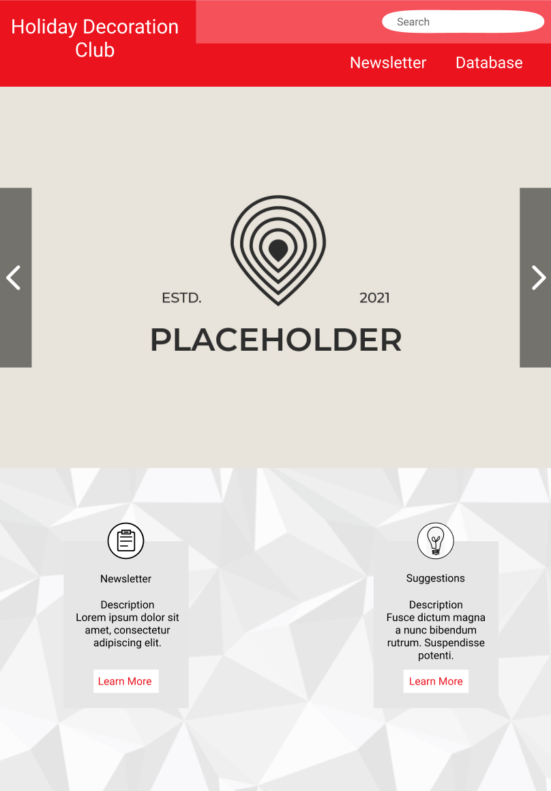

# Project



## Sponsor: Holiday Decoration Club - Avinh Huynh
### Contact Information: 
Phone Number: (619)-888-7408 <br> Email: avinhahuynh@gmail.com

## Project Idea
* home page with pictures of club things (preferably a slideshow)
* Information about how to join the club/signup/newsletter thing
* Database that stores peoples suggestions of holidays we should decorate for
* Sassy would be nice but not necessary
* Navbar

We are hosting our website through Amazon Web Services (AWS) that will be managed by our Deployment Manager, Daniel Bertino.

## Wireframe
### Home Page

[Index.html](https://kar722.github.io/kylies-disciples/webdesign)

<p float="left">
  
   
  
  
</p>

### Database
<p float="left">
   
</p>

### Newsletter
<p float="left">
   
</p>

## Liscense
We are choosing the Open Source MIT license, we will allow using the code from the Kylies-disciples GitHub to be used freely only to make and distribute closed source versions.
```
MIT License

Copyright (c) 2022 Kylies-disciples

Permission is hereby granted, free of charge, to any person obtaining a copy
of this software and associated documentation files (the "Software"), to deal
in the Software without restriction, including without limitation the rights
to use, copy, modify, merge, publish, distribute, sublicense, and/or sell
copies of the Software, and to permit persons to whom the Software is
furnished to do so, subject to the following conditions:

The above copyright notice and this permission notice shall be included in all
copies or substantial portions of the Software.

THE SOFTWARE IS PROVIDED "AS IS", WITHOUT WARRANTY OF ANY KIND, EXPRESS OR
IMPLIED, INCLUDING BUT NOT LIMITED TO THE WARRANTIES OF MERCHANTABILITY,
FITNESS FOR A PARTICULAR PURPOSE AND NONINFRINGEMENT. IN NO EVENT SHALL THE
AUTHORS OR COPYRIGHT HOLDERS BE LIABLE FOR ANY CLAIM, DAMAGES OR OTHER
LIABILITY, WHETHER IN AN ACTION OF CONTRACT, TORT OR OTHERWISE, ARISING FROM,
OUT OF OR IN CONNECTION WITH THE SOFTWARE OR THE USE OR OTHER DEALINGS IN THE
SOFTWARE.
```
